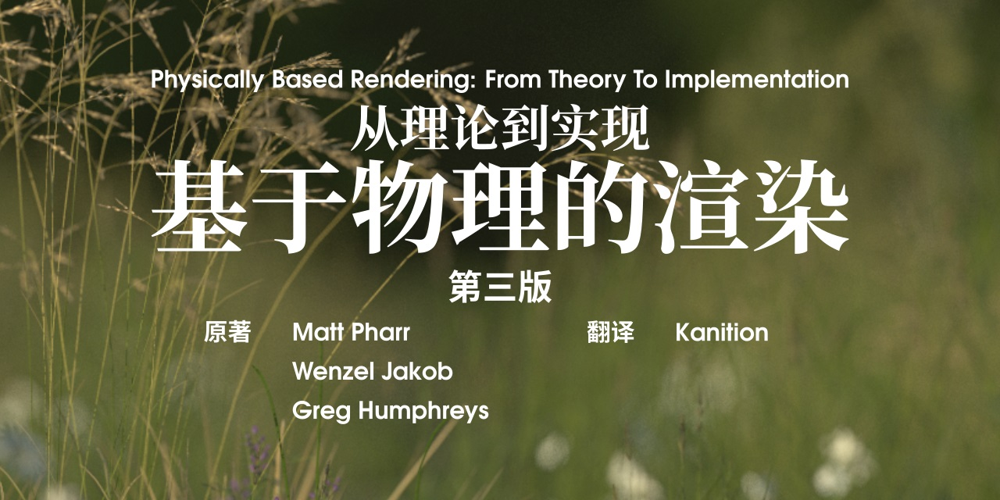

# 基于物理的渲染：从理论到实现 中文整合翻译计划
## Physically Based Rendering: From Theory To Implementation (pbrt book) 

## 作者信息
- 原著 [Matt Pharr](https://pharr.org/matt), [Wenzel Jakob](https://rgl.epfl.ch/people/wjakob) & Greg Humphreys
- 翻译 [Kanition](https://github.com/kanition)

## 下载地址：[https://github.com/kanition/pbrtbook/releases](https://github.com/kanition/pbrtbook/releases)
## 友情链接
### 第三版
* 原书官网：[https://www.pbr-book.org/](https://www.pbr-book.org/)
* 原书源码：[https://github.com/mmp/pbrt-v3](https://github.com/mmp/pbrt-v3)
* 原书代码：[https://github.com/mmp/pbr-book-website](https://github.com/mmp/pbr-book-website)
### 第四版
* 原书源码：[https://github.com/mmp/pbrt-v4](https://github.com/mmp/pbrt-v4)
### 中译版讨论区
[https://github.com/kanition/pbrtbook/discussions](https://github.com/kanition/pbrtbook/discussions)
### 我要报错
[https://github.com/kanition/pbrtbook/issues/new/choose](https://github.com/kanition/pbrtbook/issues/new/choose)

**欢迎提出宝贵意见和建议。如果你发现本书存在错误，请一定要告诉我们！**

### 翻译进度
[https://github.com/kanition/pbrtbook/projects](https://github.com/kanition/pbrtbook/projects)

### 编译指南
[https://github.com/kanition/pbrtbook/blob/main/CONTRIBUTING.md](https://github.com/kanition/pbrtbook/blob/main/CONTRIBUTING.md)

## 简介
本中译版（以下简称“本书”）系译者（笔名[Kanition](https://github.com/kanition)）自学英文经典书籍《Physically Based Rendering: From Theory To Implementation》第三版时自行翻译而成。使用本书及其源码须遵循相关许可证协议。

本书在翻译时并不完全遵照原书编排，而是根据我自己的学习情况作出了调整，包括但不限于调整顺序、增删内容、修改内容。例如扩展阅读和高阶内容部分往往超出了我的能力范围，这些内容可能会被省略；再如有一些公式可能存在笔误，我会改写并注明。

此外，翻译并不追求从英语单词到中文字词的“一一映射”。一些不涉及关键概念的词句可能会依据中文习惯作出修改，只要表达了作者的核心原意即可。因此发现英文原版词句和本书内容不完全对应是非常正常和常见的现象。

原书在线版本以网页形式呈现，可以方便地展开、折叠示例代码，但翻译制作成本书时则面临困难。本书将视具体上下文情况对示例代码做补全、删减或修改。实践时请以原书所附代码为准。

本书由LATEX编写而成，源码已经发布在上述网址，欢迎访问获取最新版。
## 许可证
 本作品采用<a rel="license" href="http://creativecommons.org/licenses/by-nc-sa/4.0/">知识共享署名-非商业性使用-相同方式共享 4.0 国际许可协议</a>进行许可。